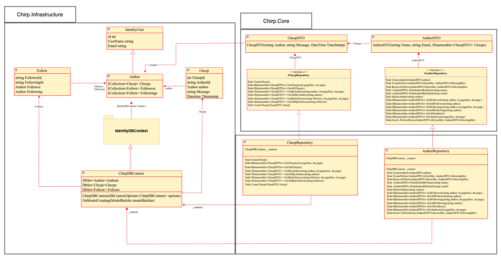
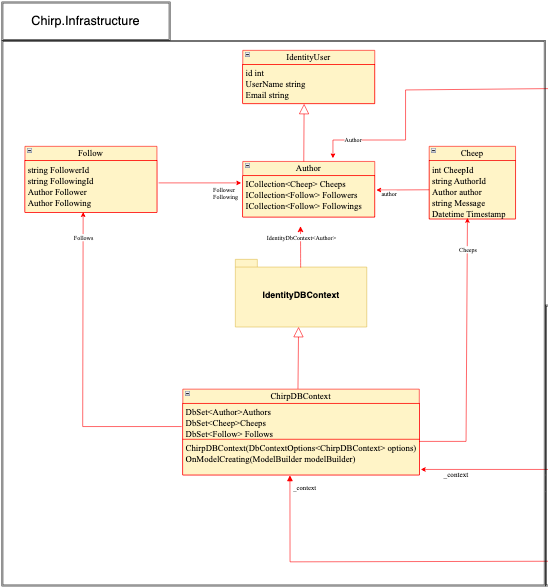
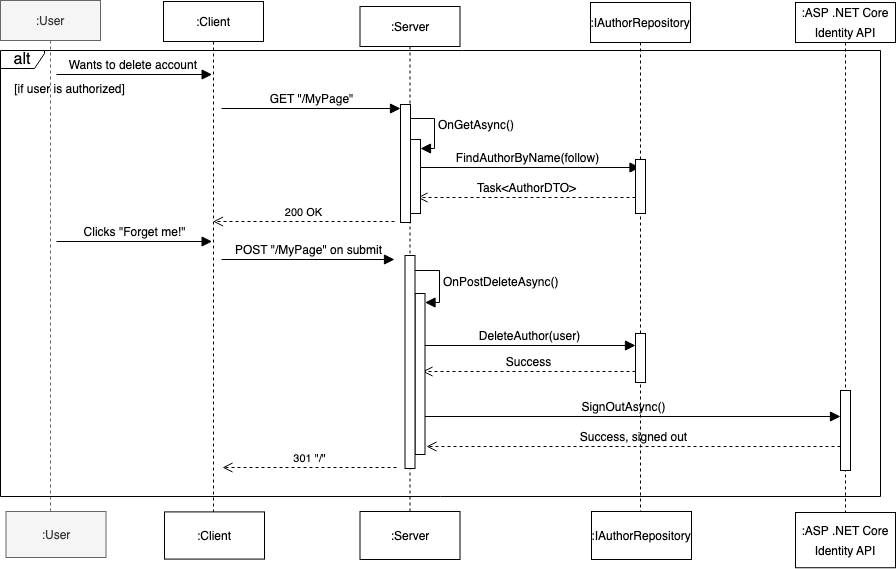

# Design and Architecture of _Chirp!_

## Table of contents:

- [Domain model](#domain-model)
- [Architecture - In the small](#architecture-in-the-small)
- [Architecture of deployed application](#architecture-of-deployed-application)
- [User activities](#user-activities)
- [Sequence of functionality/calls trough _Chirp!_](#sequence)
- [Process](#Process)
- [Build, test, release, and deployment](#build-test-release)
- [Team Work](#team-work)
  - [Description of the group’s workflow](#group-workflow)
- [How to make _Chirp!_ work locally](#chirp-local)
- [Releases](#releases)
  - [For Windows](#windows)
  - [For MacOS X](#macosx)
- [Git Cloning](#cloning)
  - [In the Terminal/Command Prompt](#terminal)
- [How to run test suite locally](#test-suite)
- [Ethics](#ethics)
  - [License](#license)
  - [LLMs, ChatGPT, CoPilot, and others](#ai)

<a id="domain-model"></a>

## Domain model



Most of the functionality of the program is stored in the Chirp.Infrastructure domain. We have the classes Author, Follow and Cheep that represent the entities in our database. As we can see in the diagram, Author is a subclass of IdentityUser, which means it inherits all the non-private fields from IdentityUser. Of these, we only use Email and Username in our code.



Cheep and Follow are coupled to Author since they both have fields that refer to Author objects. These are fields such as Author author in Cheep (because Cheep needs an author), and Author Follower and Author Following for the Follow class (because it describes follow relationships between pairs of Author objects).
ChirpDBContext inherits from Asp.Net Core’s IdentityDBContext class. It serves the purpose of creating and migrating the database and converting queries and commands between SQL statements and equivalent objects. ChirpDBContext has three DbSet<T> fields (Authors, Cheeps, Follows) that “map” to the three database tables.


The CheepRepository lets the Web domain interact with the database by implementing specific methods for creating and deleting cheeps and retrieving sorted lists of cheeps based on different conditions such as their author. In the process, it also converts Cheep objects to and from equivalent Data Transfer Object versions (CheepDTO, in Chirp.Core) in the Web domain.
The same goes for our AuthorRepository class that interacts with the Author class. The class additionally has methods which use the Follow class, such as retrieving authors followed by or following a specific author and creating and removing follower relationships. Follow is used exclusively for querying, however, so it does not have a DTO counterpart.
In conclusion, the repositories serve as both interfaces and an abstraction layer between Chirp.Infrastructure and Chirp.Web, leaving the Web domain in charge of which queries are made, and the Infrastructure domain in charge of how.


We have chosen to show our Chirp.Core layer of the diagram such that it only shows the interaction with the domain model and Chirp.Core. They interact because the repositories implement the methods defined in the equivalent interfaces. These also interact with the DTOs. Both of the DTOs have the purpose of limiting the amount of Cheep- and Author-related data that is transferred to different parts of the system. Since they transfer Cheep-/Author-related data they encapsulate properties that the entities use, that's why CheepDTO uses a string to refer to the Author instead of an Author field, and AuthorDTO uses CheepDTO for the list of cheeps that an author has.

<a id="architecture-in-the-small"></a>

## Architecture — In the small

The Onion model describes how the architecture of the program is structured by placing each specific part of the code in each of its own layers.
The illustration shows that everything related to our UI resides in the outermost layer of the architecture whilst our domain model and everything related to it, has its layer and is defined as Chirp.Infrastructure in our program. The middle layer contains the interfaces, which works with the controllers and our domain, which are located in the Chirp.Core part of our code.
This architecture allows us to have a structured program that gives the developers an easy overview of the different parts of our code and how they each play their significant roles in the system.


<a id="architecture-of-deployed-application"></a>

## Architecture of deployed application


There are two versions of our application. The main branch in our repository contains the version which is deployed on Azure. The chirp-sqlite branch contains the version released on Github. The Azure version uses SQLServer instead of SQLite for the database connection.
Our database subscription ran out of credits and our student subscription was locked, and since we were limited in time when we could access TA help, we elected to instead spend that time working on and getting help for other parts of the project. Therefore, we wanted it to be able to run locally again.
We chose to switch back to SQLite because running an SQLite database doesn’t require any other programs to be installed and run, whereas SQLServer would require the user to start a Docker container or an SQLServer instance on their computer before starting _Chirp!_, and they might do this in many different ways which would have to be accounted for in the connection string.
So to make things simple, we returned to SQLite. Eventually, we found that we had spare time at the end of the project and used this to recreate the web deployment. However, we make no promises that it won’t disappear again by the time it is reviewed. If this happens, refer to the last release and the last commit to chirp-sqlite instead.


<a id="user-activities"></a>

## User activities


1. A user activity diagram describing how an unauthorized user logs in and tries to post a Cheep.


2. An activity diagram describing how an authorized user can view their own timeline as well as follow different users and view their following as well as their cheeps.


3. An activity diagram showcasing how an authorized user can view the list of all users of the application under the ‘All users’ page, which is only accessible to users who are registered and logged in.


4. This user activity diagram shows what happens when a user presses the ‘forget me’ button on My page.

<a id="sequence"></a>

## Sequence of functionality/calls trough _Chirp!_

We have chosen to do a UML Sequence Diagram for every call to any endpoint in our version of _Chirp!_ The diagrams show the flow of data from the moment a user clicks around on the website, triggering GET or POST requests through Razor Pages, which are then handled through our defined methods for so in our relevant repositories.
The endpoints we cover in the diagrams are as follows, for the following wishes of the user:

to access _Chirp!_
to authorize in some way
to post a Cheep on the public timeline
to follow any arbitrary user
to see the postings of followed userse
to see all registered users of _Chirp!_
to delete one’s account.


1: UML Sequence diagram showing an unauthorized user's call to root endpoint “/”.


2: UML Sequence diagram showing the flow of data when a user registers, logs out, & logs in.


3: UML Sequence diagram showing flow through posting a cheep.


4: UML Sequence diagram of following another user.


5: UML Sequence diagram of a user wanting to see the cheeps of who they follow and the users they follow


6: UML Sequence diagram of a user wanting to see all users in _Chirp!_



7: UML Sequence diagram of deleting one’s account


8: Complete UML Sequence diagram of the entire flow through time, as an unauthorized user goes to the root endpoint, registers, logs out, logs in, and goes through the features of _Chirp!_ This diagram contains the same flows as the previous diagrams, but put together in one complete flow.

<a id="process"></a>

# Process

<a id="build-test-release"></a>

## Build, test, release, and deployment

Our _Chirp!_ project has 3 GitHub action workflows, excluding the dependabot workflow.
The build_and_test workflow triggers on any push and pull request on any branch. It builds the project on the branch and runs the whole test suite.


The release workflow is triggered when any new tag containing “v*.*.\*” (To be read as RegEx, with the asterisks representing any number of any characters) is pushed to the repository. The entire project except the test suite is built, and then the files are compressed into single file executables for Linux, Windows, and Mac and compressed with the static files into zip files. These are finally released on GitHub under the tag name, along with the source code in zip and tar.gz files.


The deployment workflow is triggered by pushes on the main branch and the “sqlserver” branch. Once again, the project is built without a test suite. An executable is made, but the used libraries are left external. An artifact (which is a file used by Azure to track and share dependencies) is uploaded first, then downloaded again and used as part of the deployment process.


<a id="team-work"></a>

## Team work


As seen in the screenshot of our project board on GitHub right before hand-in, there are a couple of issues that remain unfinished, either due to other issues having higher priority or due to time constraints. Fixing compiler warnings was a continuous task. Other unresolved issues mostly revolve around testing. We would have liked to have had additional tests of varying types in our test suite, but refactors repeatedly breaking the current tests in addition to new feature requirements for the application _Chirp!_ and time constraints made us unable to do so.

<a id="group-workflow"></a>

### Description of the group’s workflow


We had physical meetings twice a week, on Tuesday and Thursday. On Thursday after lectures, we created new issues for new features based on the lecture content, discussed upcoming tasks and divided into pairs for pair programming. The actual pair programming would then usually take place in small online meetings of 2 and 3 people during the weekend. Each pair worked on different incomplete issues, creating separate development branches to implement new features or fix something that had stopped working. Weekend meetings depended on task importance and member availability. On Tuesdays, we reviewed the implemented changes and merged any development branches into the main branch to see if everything worked correctly. If any major problems had occurred we would collaborate on solving them and suggest possible solutions to fix the problem. Otherwise, pairs would continue to work on incomplete issues or solving other smaller issues. In cases where we were unable to find a solution, we would ask the teaching assistants (TAs) for guidance. Their assistance would sometimes get us back on track or help restore the code to a functional state. By striving for this workflow we aimed to maintain a consistent development process.

<a id="chirp-local"></a>

## How to make _Chirp!_ work locally

<a id="releases"></a>

### Releases

<a id="windows"></a>
For **Windows**

1. Go to [our GitHub repository](https://github.com/ITU-BDSA23-GROUP16/Chirp). Click on the latest version of _Chirp!_ found on the right hand side of the screen beneath "Releases".
2. Download the zip file depending on which operating system you are using.
3. Once downloaded, right click the zip file and extract the files.
4. Once extracted, run the "Chirp.Web.exe"
5. The terminal should now show a lot of text. Locate where it says "Now listening on: http​&#65279;://localhost:" and a port number following that. Type the URL into address bar of your web browser and press enter to open the application.
6. You should be able to see the "Public timeline" with several cheeps displayed. Press the reigster button in the navigation bar and register your account.
7. Once registered, press the "Log in" button in the navigation bar

You should now be able to freely explore _Chirp!_

<a id="macosx"></a>
For **MacOS X**

1. Go to [our GitHub repository](https://github.com/ITU-BDSA23-GROUP16/Chirp). Click on the latest version of _Chirp!_ found on the right hand side of the screen beneath "Releases".
2. Download the zip file depending on which operating system you are using.
3. Once downloaded, double click the zip file to extract the files.
4. Right click on the folder and select the "New terminal at folder" option.
5. Type the following command into the terminal:

```
sudo ./Chirp.Web
```

6. Enter the password for your device when prompted, and press enter.
7. If a warning shows up saying "“Chirp.Web” cannot be opened because the developer cannot be verified" follow the steps below bypass it.
   1. Close the warning by pressing "Cancel"
   2. Go to "System Preferences" on your Mac
   3. Click on "Privacy and Security"
   4. Scroll down to "Security"
   5. You should see a message saying "Chirp.Web was blocked from opening because it is not from an identified developer." Click on the "Allow Anyway" next to it.
8. Go back to the terminal and type the same command into the terminal:

```
sudo ./Chirp.Web
```

9. Enter the password for your device when prompted, and press enter.
10. If a new warning shows up saying: "macOS cannot verify the developer of “Chirp.Web”. Are you sure you want to open it?" Press "Open"
11. The terminal should now show a lot of text. Locate where it says "Now listening on: http​&#65279;://localhost:" and a port number following that. Type the URL into address bar of your web browser and press enter to open the application.
12. You should be able to see the "Public timeline" with several cheeps displayed. Press the reigster button in the navigation bar and register your account.
13. Once registered, press the "Log in" button in the navigation bar

You should now be able to freely explore _Chirp!_

<a id="cloning"></a>

### Git Cloning

<a id="terminal"></a>
In the _\*\*Terminal/Command Prompt_:

1. Open a new terminal/command prompt at the folder of your choice and type the following command:

```
git clone https://github.com/ITU-BDSA23-GROUP16/Chirp.git
```

2. After the cloning process has been done, navigate into the project directory using

```
cd Chirp
```

You might need to set the correct clientId and clientSecret before running. Use the following commands:

```
dotnet user-secrets init --project src/Chirp.Infrastructure
```

```
dotnet user-secrets set "authentication_github_clientId" "bddd5a8f9b0d7f2c7860" --project src/Chirp.Infrastructure
```

```
dotnet user-secrets set "authentication_github_clientSecret" "1a1d6035b5032e1ae90a4161e331602b037bceec" --project src/Chirp.Infrastructure
```

Run the project by typing the following into the command line:

```
dotnet run --project src/Chirp.Web.
```

3. The program might be able to run and you should be able to follow a link to a localhost instance of the web application through the terminal. It might not work due to trying to connect to the same database as the already running Chirp web app. In that case, you may want to start a Docker container and change the connection string in src/Chirp.Web/Program.cs line 27 to connect to it until you can set up your own Server.
4. The first thing you should be able to see in our program is the ‘Public timeline’ with all the cheeps displayed from our database. You can’t do much before you’re signed into our system, so to do that, you’ll have to navigate towards the ‘Register’ page in the navigation bar and then register with any mail address you want. Once your registration has been completed, you should then head towards the ‘log in’ page that is also located in the navbar and log in with the same mail you’ve registered with. Once that’s done, you’re free to explore our _Chirp!_ webapp.

<a id="test-suite"></a>

## How to run test suite locally

Throughout our project we've made different unit and integration tests, to test the functionality, the different properties and how the different parts of the system interact with correct and incorrect outcomes.

_Navigation of the test_
To run our tests, simply type in “dotnet test” in the VSCode terminal.

_AuthorRepositoryTest Suite_
The integration test **‘AuthorRepositoryTest’** tests the validity of the AuthorRepository methods, and how the different classes interact with each other. Here we test if we can create an author, a follower, if we can find the author, remove it etc.

The tests **CreatedExists** & **FollowerExists** test if we can create an author/follow, retrieve it and see if it exists in the database.

- **CreatedUnique** checks if trying to create two identical authors correctly results in an exception, ensuring that the uniqueness condition is upheld.
- **FindByName** & **FindByEmail** test if we can retrieve a name and an email from the author in the database.
- **FindFollower** & **FindFollowing** check if we can find a follower and the person an author is following.
- **RemoveFollow** tests that a follower is deleted from the database.

_CheepRepositoryTest Suite_
The integration test in ‘CheepRepositoryTest’ tests the validity of the CheepRepository and how different parts interact with one another. Here we test if we can create a cheep, get the cheeps from the public timeline and much more.

The following tests:

- **AddCheeps** tests if an author can add a new cheep in our database.
- **GetPublicCheeps** tests if the cheeps from the public timeline can be retrieved.
- **GetAuthorCheeps** tests if the cheeps from a specific author can be retrieved.
- **GetFollowerCheeps** tests if the cheeps from the authors you follow can be retrieved.
- **GetPages** tests if the pagination is correct and matches the author's location.

_AuthorTest_
The **AuthorTest** contains different unit tests, where we test the different properties regarding an Author, by using the AuthorDTO object. The test includes the correctness and incorrectness of the properties name and cheep list length.

_CheepTest_
The **CheepTest** contains different unit tests as well. Here we test the timestamp property, to see the correct and incorrect matches of the cheep. We test the message formatting as well, to see if we retrieve the correct message, and if it matches or not. _Side note:_ When testing time property on Windows, the timestamp differs from the Macbook timestamp. On Windows a timestamp would look something like this

```
12.09.21
```

whilst on Mac, it would look something like this:

```
12:09:21
```

Hence the timestamp tests may not pass on some Window devices.

<a id="ethics"></a>

# Ethics

<a id="license"></a>

## License

For our software, we have chosen to license it under the MIT license. This is firstly because between all the packages we used for our project, the MIT license was the most common among them.
Additionally, the MIT license is favored for being short and simple. It gives developers a lot of freedom in how they use the licensed software. The MIT license permits users to use the software and derived software for commercial reasons and private purposes. It grants that a person obtaining a copy of this software can use it without any restriction such as copy, merge, publish, modify etc, but that the copyright notice and the permission of MIT license is included in all copies.[source]

[source]: choose an open source license, https://choosealicense.com/licenses/mit/ - (last accessed 20/12-23)

<a id="ai"></a>

## LLMs, ChatGPT, CoPilot, and others

Although taken into consideration beforehand, we ended up not using any LLMs to assist us over the course of the project.
